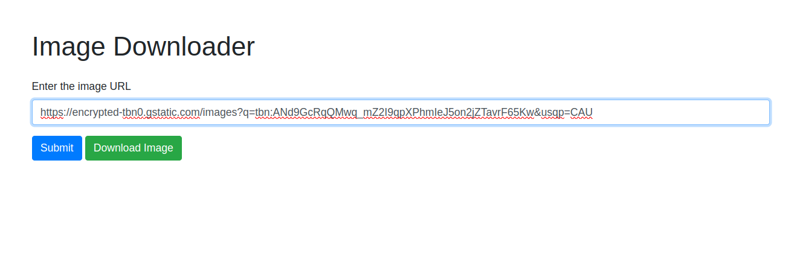

This Flask web application serves as an Image Downloader, allowing users to input an image URL and download the corresponding image. Here's a brief description of what the program offers to users:

Image Download: Users can input the URL of an image in the provided form. Upon submitting the form, the application downloads the image from the specified URL.

Error Handling: The program provides error handling for scenarios where the image cannot be downloaded. If an error occurs during the download process, an error message is displayed to the user.

Preview and Download: After a successful download, the application displays a preview of the downloaded image. Additionally, a "Download Image" button is provided, allowing users to download the image directly to their local machine.

User-Friendly Interface: The application has a simple and user-friendly interface. Users are guided to enter the image URL through a form, and any errors or success messages are clearly communicated.

Technological Stack: The application is built using the Flask web framework in Python. It utilizes the requests library to fetch the image from the specified URL and the PIL (Python Imaging Library) for image processing. The Flask app handles both the image download and the subsequent download link generation.

Overall, this program provides a convenient and straightforward way for users to download images from URLs, making it accessible and useful for a variety of purposes such as content creation, image analysis, or simply obtaining images from the web.

#huggingface link
https://huggingface.co/spaces/razaAhmed/ImageDownloader